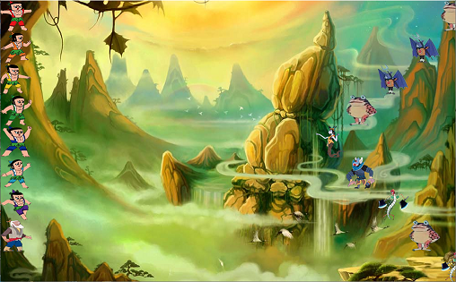
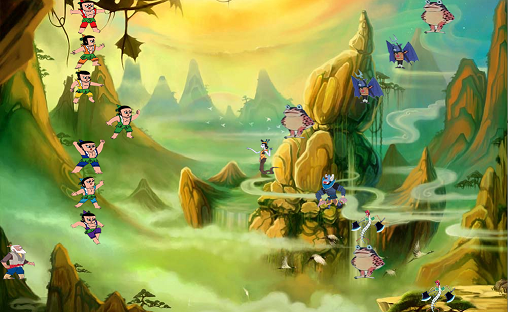

## 葫芦娃
151220154 余翔 
#### 概述
从前有一块大陆（map），大陆上住着葫芦娃兄弟和他们的爷爷，还有一些会魔法妖怪。有一天葫芦娃兄弟和妖怪们有了冲突，于是由大娃带领的葫芦娃兄弟与由蝎子精和蛇精带领的妖怪们在大陆上摆开阵型准备交战。闻讯而来的爷爷来到战场为葫芦娃加油，一场旷世大战千钧一发.....： 
***
#### 模块介绍
* 生物：生物分别由（Huluwa类、Evil类、Grandpa类）进行实现，这些类使用了Creature接口（生物基本行为），Fight接口（搜寻敌人），以及Runable接口（多线程）。
* 位置：位置分为Position（一维坐标）、TwoDimPosition（二维坐标），其中TwoDimPosition是继承Position进而实现的。
* 地图：地图（Map），战场（Field）。地图（Map）是战场的载体，也就是说战场是添加在地图上的。在Field这个类中主要实现的是战场的构建和绘制。
* 阵型：阵型分为多种，他们统一继承Formation这个类，通过实现Arrange这个接口，可以将阵型添加到战场上。
* 文件存取：FileHelper是用来实现信息的存取的。同时我定义了一个info类，作为存取信息的载体。

***
#### 面向对象机制
*  继承 
使用extends关键字来实现派生类对基类的继承，以实现代码的复用。同时通过方法的重写，动态绑定，实现了多态性。例如：让二维坐标（TwoDimPosition）继承一维坐标（Position）。
* 接口 
利用implements关键字，制定类的接口，从而规范对象的行为，并且完成了接口与实现的分离，提高了编译的效率。例如规范化阵型接口（Arrange），让阵型有一个统一的接口借此排布在地图上（map） 

#### 异常处理
Java中异常提供了一种识别及响应错误情况的一致性机制，有效地异常处理能使程序更加健壮、易于调试。在葫芦娃程序中添加了很多异常处理，例如设置生物位置时，坐标是否越界；读取文件时，文件是否存在或者是否已经读到文件末尾等等。

#### 泛型
泛型的主要目标是提高Java程序的类型安全。通过知道使用泛型定义的变量的类型限制，编译器可以在一个高得多的程度上验证类型假设。同时泛型还可以消除源代码中的许多强制类型转换。这使得代码更加可读，并且减少了出错机会。在葫芦娃程序中同样使用到了泛型，比如使用ArrayList<Creature>来存储地图上的生物（Huluwa、Evil、Grandpa）。

#### 输入输出
在葫芦娃程序中，需要将战况进行存储和读取。这涉及到Java的输入输出机制。在实现过程中，我通过定义一个info类，用来保存我所需要存取数据的信息，利用objecOutputStream将info类保存至文件，在读取时利用objectInputStrea将info类读取并解析成想要的数据。

#### 并发
葫芦娃程序中采用多线程开发，程序中的每一个生物对应一个线程。因为涉及到多线程，难免会出现资源竞争情况，例如生物移动时对于位置的竞争问题。在设计时，我使用了Lock这个接口，当生物要设置位置坐标时，Lock.lock();当生物设置位置坐标结束后，Lock.unlock()。这样使得生物在移动过程中不会出现拥挤抱团的情况。

#### 单元测试
葫芦娃这个程序中，对比较重要的方法进行了单元测试用例。例如测试坐标越界情况，文件读取是否成功，生物之间是否可以相互战斗。
#### 设计理念
* SRP 单一职责原则 
对于每个类，简化它的功能。譬如阵型独立成类，与空间分开。

* LOD 迪米特法则 
弱化类与类之间的耦合性，尽量通过接口来建立类与类之间的联系。 

#### 一些细节
在葫芦娃程序中，我为生物设置了生命值、攻击力、移动速度、以及状态。通过增加生命值和攻击力使得战局更加的刺激与精彩，两两对战会有回合制的感觉。同时我为生物添加了不同状态，其中：寻路（表示生物正在搜寻敌人），攻击前进（生物向前攻击），攻击后退（生物攻击完后退）。设计这些状态主要是为了实现攻击时的动画效果。

#### 具体操作
运行程序，空格键开始战斗，R键重新战斗，L选择战局。（最精彩的战局保存为在battle目录下的Drasticest.txt）

#### 战局展示
 
 
 
